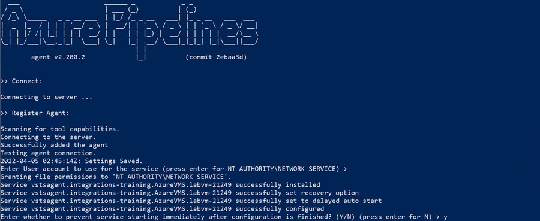

# Configure a self hosted agent on an Azure Windows VM

[Self-hosted Windows agents](https://docs.microsoft.com/en-us/azure/devops/pipelines/agents/v2-windows?view=azure-devops)

[Buildtools für Visual Studio 2019](https://visualstudio.microsoft.com/de/downloads/?rr=https%3A%2F%2Fwww.google.com%2F)

## Demo

Execute `create-agent-vm.azcli` to install the vm in Cloud Shell using:

```bash
curl https://raw.githubusercontent.com/arambazamba/az-400/main/Demos/04-AzurePipelines/Demo-06/create-agent-vm.azcli | bash
```

> Note: If you want to change the vm size use: `az vm list-sizes --location westeurope -o table`

Execute `install-sw-devops-agent-vm.ps1` from inside the vm you created in the prev step to install Build Agent on VM:

```powershell
Set-ExecutionPolicy Bypass -Scope Process -Force;
Invoke-Expression ((New-Object System.Net.WebClient).DownloadString('https://raw.githubusercontent.com/arambazamba/az-400/main/Demos/04-AzurePipelines/Demo-06/install-sw-devops-agent-vm.ps1'))
```

Create an agent pool `AzureVMS` in `https://dev.azure.com/<tenant>/<project>/_settings/agentqueues`

Complete the agent config:

```PowerShell
cd \agent
.\config.cmd --pool "AzureVMS" --agent $env:COMPUTERNAME --runasservice --work '_work' --url 'https://dev.azure.com/integrations-training/' --projectname 'M04-AzurePipelines' --auth PAT --token lz4w2...
```


