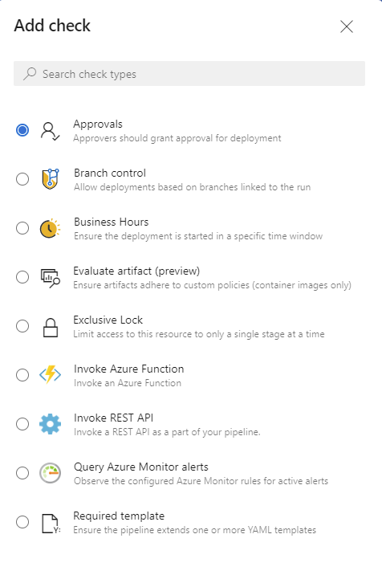

# Environments

- Import `environment-checks.yml`
- Explain checks

    

- Show Invoke Azure Function using `az-funct-check`    

    

    

## Snippets to connect to Microsoft Teams

Post to Teams using an [Incoming Webhook](https://docs.microsoft.com/en-us/microsoftteams/platform/webhooks-and-connectors/what-are-webhooks-and-connectors) and [Adaptive Cards](https://docs.microsoft.com/en-us/microsoftteams/platform/task-modules-and-cards/what-are-cards):

To register an Incoming Webhook in Teams use this [guide: Create Incoming Webhook](https://docs.microsoft.com/en-us/microsoftteams/platform/webhooks-and-connectors/how-to/add-incoming-webhook). 

You can use `/cards/test-card.ps1` to test your Webhook. Save the Url of your Webhook to a new file `/cards/webhookuri.txt`:

```Powershell
$json = Get-Content -Path .\card.json
$uri =  Get-Content -Path .\webhookuri.txt
Invoke-RestMethod -Method post -ContentType 'Application/Json' -Body $json -Uri $uri
```

To get back from the Azure Function to your Azure DevOps Organisation use this pattern documented [here](
https://docs.microsoft.com/en-us/azure/devops/pipelines/tasks/utility/azure-function?view=azure-devops)

```Json
POST  {planUri}/{projectId}/_apis/distributedtask/hubs/{hubName}/plans/{planId}/events?api-version=2.0-preview.1 HTTP/1.1
content-type: application/json

{
   "name": "TaskCompleted", "taskId": "taskInstanceId", "jobId": "jobId", "result": "succeeded" 
}
```
