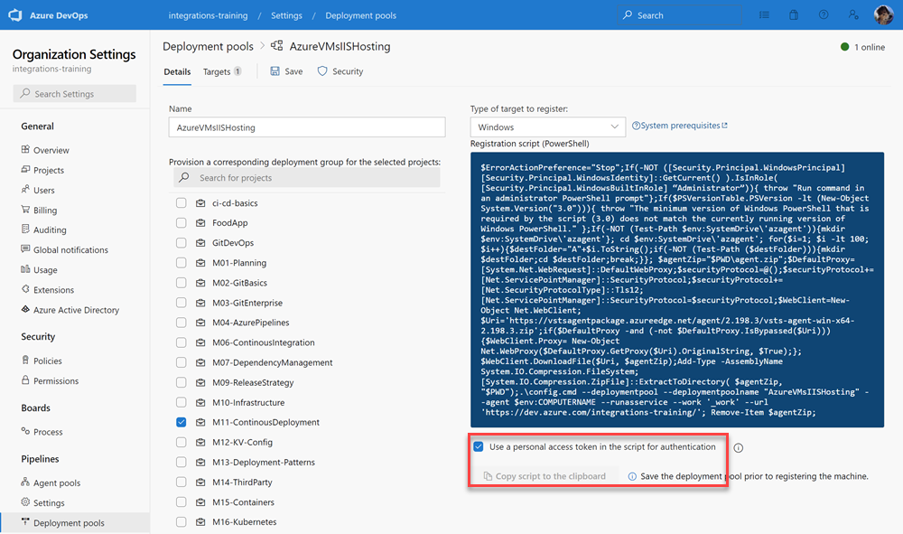

# Deployment - Getting started

[Provision deployment groups](https://docs.microsoft.com/en-us/azure/devops/pipelines/process/deployment-jobs?view=azure-devops)


## Demos

Execute `create-deployment-vm.azcli` to create a vm to deploy to

Ensure that IIS is installed. To install all feature use an elevated PowerShell prompt and execute:

```
Get-WindowsOptionalFeature -Online | where FeatureName -like 'IIS-*'
```

Create a deployment group. Copy Script and execute in an elevated PowerShell prompt:



>Note: You can also use the vm from module 04 or install the agent using choco:

```powershell
Set-ExecutionPolicy Bypass -Scope Process -Force; 
[System.Net.ServicePointManager]::SecurityProtocol = [System.Net.ServicePointManager]::SecurityProtocol -bor 3072; 
Invoke-Expression ((New-Object System.Net.WebClient).DownloadString('https://chocolatey.org/install.ps1'))


choco install azure-pipelines-agent --params "'/Directory:c:\agent'" -y
```

Complete the agent config:

```PowerShell
cd \agent
.\config.cmd --deploymentgroup --deploymentgroupname "Azure-Webserver" --agent $env:COMPUTERNAME --runasservice --work '_work' \
--url 'https://dev.azure.com/integrations-training/' \
--projectname 'M11-ContinousDeployment' --auth PAT --token exaymaqys....
```


Check the agent:


