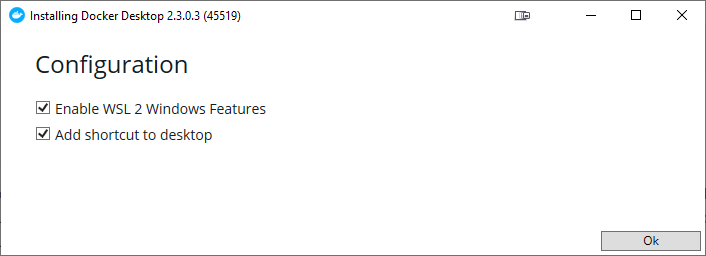

# Install Windows Subsystem Linux

Requires Windows 10 - May 2020 Update or higher. To Update use this [link](https://www.microsoft.com/de-de/software-download/windows10).

[Install WSL 2](https://docs.microsoft.com/en-us/windows/wsl/install)

```
wsl --install
```

## Install Frameworks & Runtimes

[Introduction to Bash Scripting](https://www.taniarascia.com/how-to-create-and-use-bash-scripts/)

- Examine install scripts in folder `/wsl-docker`

## Configure Docker Support

Download & Install [Docker Desktop for Windows](https://desktop.docker.com/win/main/amd64/Docker%20Desktop%20Installer.exe?utm_source=docker&utm_medium=webreferral&utm_campaign=dd-smartbutton&utm_location=header)

Configure Docker Desktop:



Create an account at [Docker Hub](https://hub.docker.com/) and signin to Docker


Configure Cocker:


Enable Kubernetes:


Press Appy & Restart to complete Docker Setup

## Test Installation

In the console window execute:

```
docker run hello-world
```

